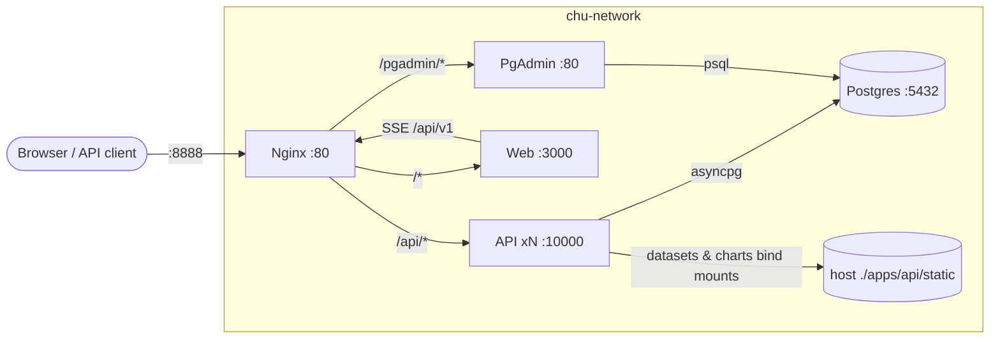

# CHU Platform — Dockerisation Guide

This document explains how the CHU Platform is containerised and how the whole
application is exposed through a single **Nginx load balancer**.

- [Architecture](#architecture)
- [Services](#services)
- [How traffic flows through Nginx](#how-traffic-flows-through-nginx)
- [Dockerfiles](#dockerfiles)
- [Environment variables](#environment-variables)
- [Quick start](#quick-start)
- [Scaling the API](#scaling-the-api)
- [Data persistence](#data-persistence)
- [Database migrations](#database-migrations)
- [Containerisation gotchas we solved](#containerisation-gotchas-we-solved)
- [Useful commands](#useful-commands)
- [Troubleshooting](#troubleshooting)

---

## Architecture

The platform is split across **6 containers** on a shared Docker network
(`chu-network`). Nginx is the **single entry point**: it serves the web app,
load-balances API requests, and exposes PgAdmin under a sub-path. Nothing else
is published to the host.



| Container | Role | Internal port | Published |
|---|---|---|---|
| `nginx` | Load balancer / reverse proxy | `80` | `${NGINX_PORT}` (default `80`) |
| `web` | SvelteKit (adapter-node) frontend | `3000` | — |
| `api` | FastAPI backend (scalable) | `10000` | — |
| `pgadmin` | DB admin UI (under `/pgadmin`) | `80` | — |
| `postgres` | PostgreSQL 16 | `5432` | `${POSTGRES_PORT}` (for local tooling) |

---

## Services

### `nginx` — load balancer / reverse proxy

`nginx:1.27-alpine` with a mounted, read-only config
([`nginx/nginx.conf`](nginx/nginx.conf)).

- Round-robins across every entry in the `api_servers` / `web_servers` /
  `pgadmin_servers` upstream blocks.
- Disables response buffering for `/api/` so **SSE chat streams** reach the
  browser live.
- Allows large uploads (`client_max_body_size 100m`).

### `api` — FastAPI backend

Built from [`apps/api/Dockerfile`](apps/api/Dockerfile) (build context = repo
root). Runs `uvicorn` on `0.0.0.0:10000`. Reads its config from environment
(`DATABASE_URL`, `OPENAI_*`, `AGENT_MODEL`, `CHARTS_DIR`).

- `scale: ${API_REPLICAS:-1}` → start with 1 instance, scale out later.
- Depends on `postgres` being **healthy**.
- Bind-mounts `apps/api/static/{datasets,charts}` so files persist on the host.

### `web` — SvelteKit frontend

Built from [`apps/web/Dockerfile`](apps/web/Dockerfile) (build context =
`apps/web`). A multi-stage `oven/bun` build produces the adapter-node output in
`build/`, served on `HOST=0.0.0.0` `PORT=3000`.

The web app talks to the API at **same-origin** `/api/v1/...` (relative URLs),
so Nginx handles all proxying — no API host config needed.

### `pgadmin` — database admin

`dpage/pgadmin4:latest` with `SCRIPT_NAME=/pgadmin` so it serves correctly
under the Nginx sub-path. Login via `PGADMIN_EMAIL` / `PGADMIN_PASSWORD`.

### `postgres` — database

PostgreSQL 16 with a healthcheck (`pg_isready`). Credentials come from
`POSTGRES_USER` / `POSTGRES_PASSWORD` / `POSTGRES_DB`.

---

## How traffic flows through Nginx

| URL | Target | Notes |
|---|---|---|
| `/` | `web:3000` | SvelteKit app |
| `/api/` | `api:10000` | Load-balanced; `proxy_buffering off` for SSE |
| `/api/v1/charts/...` | `api:10000` | Static charts served by FastAPI |
| `/pgadmin/` | `pgadmin:80` | Full `/pgadmin/...` path forwarded (no stripping) |

> **Why no prefix stripping for PgAdmin?** PgAdmin runs with
> `SCRIPT_NAME=/pgadmin` and rejects any request whose path does not start with
> `/pgadmin`. The `proxy_pass http://pgadmin_servers;` (no trailing slash)
> forwards the URI untouched.

---

## Dockerfiles

### `apps/api/Dockerfile`

- Base: `ghcr.io/astral-sh/uv:python3.12-bookworm-slim`.
- `PYTHONPATH=/app/apps/api/src:/app/packages:/app` — makes the `api` package
  and the root `packages/` tree (`ai`, `agents`, `tools`, `analysis`) importable
  from source.
- Dependencies installed with `uv sync --frozen --no-install-project --no-dev`
  plus `alembic` / `openpyxl`.
- **Install before copying source** so code changes reuse the cached dependency
  layer.
- `RUN mkdir -p .../charts .../datasets` because FastAPI mounts
  `StaticFiles(...)` at import time.
- `HEALTHCHECK` hits `/health`.

### `apps/web/Dockerfile`

- Multi-stage `oven/bun:1-alpine`: `bun install --frozen-lockfile` →
  `bun run build` (adapter-node output in `build/`).
- Runtime stage copies `build/`, `node_modules/`, `package.json` and runs
  `bun ./build/index.js`.
- `HEALTHCHECK` fetches `/`.

### `.dockerignore`

- Root `.dockerignore` keeps the **API build context** lean (excludes `.venv`,
  `node_modules`, notebooks, `*.csv`, `.env`, charts).
- `apps/web/.dockerignore` keeps the **web build context** lean (excludes
  `node_modules`, `.svelte-kit`, `build`, `.env`).

---

## Environment variables

Defined in `.env` (see [`.env.example`](.env.example)).

| Variable | Default | Purpose |
|---|---|---|
| `POSTGRES_USER` | `postgres` | Postgres user |
| `POSTGRES_PASSWORD` | `postgres` | Postgres password |
| `POSTGRES_DB` | `app` | Postgres database |
| `POSTGRES_PORT` | `5432` | **Host** port for Postgres (local tooling) |
| `DATABASE_URL` | — | Local connection string (derived from the above) |
| `OPENAI_BASE_URL` | — | LLM endpoint |
| `OPENAI_API_KEY` | — | LLM API key |
| `AGENT_MODEL` | — | LLM model |
| `CHARTS_DIR` | `static/charts` | Charts directory |
| `NGINX_PORT` | `80` | **Public** port exposed by Nginx |
| `API_REPLICAS` | `1` | Number of API instances behind the load balancer |
| `PGADMIN_EMAIL` / `PGADMIN_PASSWORD` | `admin@example.com` / `admin` | PgAdmin login |

Inside the compose network the API is given a container-aware
`DATABASE_URL` pointing at `postgres:5432` (overriding the `.env` value that
uses `localhost` for local development).

---

## Quick start

```bash
# 1. Configure .env
cp .env.example .env
#    - set OPENAI_API_KEY
#    - optionally change NGINX_PORT, POSTGRES_PORT, API_REPLICAS

# 2. Build & start the whole stack
docker compose up -d --build

# 3. Apply database migrations (once)
docker compose exec api alembic upgrade head

# 4. Check status
docker compose ps
```

| Service | URL |
|---|---|
| Web app | http://localhost:${NGINX_PORT} |
| API | http://localhost:${NGINX_PORT}/api/v1 |
| PgAdmin | http://localhost:${NGINX_PORT}/pgadmin |
| Postgres (host) | localhost:${POSTGRES_PORT} |

---

## Scaling the API

The `api` service defaults to 1 instance (`API_REPLICAS=1`). Nginx
round-robins across every entry in the `api_servers` upstream. Scale out with:

```bash
docker compose up -d --scale api=3
```

Conversation / checkpoint state lives in **Postgres**, and datasets/charts are
on **shared bind mounts**, so any instance can serve any request.

---

## Data persistence

| Data | Storage | Type |
|---|---|---|
| Postgres data | `postgres_data` volume | named volume |
| PgAdmin config | `pgadmin_data` volume | named volume |
| Uploaded datasets | `./apps/api/static/datasets` | bind mount (host) |
| Generated charts | `./apps/api/static/charts` | bind mount (host) |

Bind-mounting datasets/charts means:

- Uploads and charts **persist on the host** across container rebuilds.
- All scaled API replicas see the **same files**.

---

## Database migrations

```bash
# Run migrations inside the running API container
docker compose exec api alembic upgrade head

# Create a new revision (from the repo root, against host Postgres)
cd apps/api && uv run alembic revision --autogenerate -m "description" && cd ../..
```

---

## Containerisation gotchas we solved

These were the issues hit while getting the stack running, and how they were
fixed. Worth knowing before changing the Docker setup.

### 1. `ModuleNotFoundError: No module named 'agents'`

Locally, `uv sync` installs the root `chu-platform` project as an **editable**
package, which exposes `ai`, `agents`, `tools`, `analysis`. The image uses
`--no-install-project`, so the packages were never installed.

**Fix:** add `/app/packages` to `PYTHONPATH` so the packages resolve directly
from source:
```
PYTHONPATH=/app/apps/api/src:/app/packages:/app
```

### 2. `RuntimeError: Directory '.../static/charts' does not exist`

FastAPI mounts `StaticFiles(directory=.../charts)` at **import time** — before
the lifespan handler creates the directory.

**Fix:** `RUN mkdir -p /app/apps/api/static/charts /app/apps/api/static/datasets`
in the Dockerfile (the charts dir is excluded from the build context).

### 3. `FileNotFoundError` for dataset CSVs (host vs container paths)

Dataset records in Postgres store **host-absolute** paths (e.g.
`/home/.../apps/api/static/datasets/diabetes_....csv`) created while running
the API locally. Inside the container that path doesn't exist.

**Fix (two parts):**
- `resolve_dataset_path()` in `dataset_service.py` — if the stored path doesn't
  exist, fall back to the same filename inside the configured datasets dir.
  Applied at every `filepath` read: `_load_dataframe`, dataset delete, the
  agent dataset registry, and the chat route.
- Bind-mount `apps/api/static/datasets` (and `charts`) into the container so the
  files are actually visible and persist.

### 4. PgAdmin returned HTTP 500

PgAdmin runs with `SCRIPT_NAME=/pgadmin` and rejects requests whose path does
not start with `/pgadmin`. The original Nginx config stripped the prefix
(trailing slash on `proxy_pass`).

**Fix:** forward the full `/pgadmin/...` path (`proxy_pass http://pgadmin_servers;`
— no trailing slash).

### 5. `bun install --frozen-lockfile` failed

`apps/web/bun.lock` was out of sync with `package.json` (missing
`@types/prismjs`).

**Fix:** ran `bun install` in `apps/web` and committed the updated lockfile.

---

## Useful commands

```bash
# Build / start / stop / teardown
docker compose up -d --build
docker compose down
docker compose down -v   # ALSO removes named volumes (data loss!)

# Logs
docker compose logs -f nginx
docker compose logs -f api

# Rebuild just one service
docker compose up -d --build api

# Validate compose / nginx config
docker compose config --quiet
docker exec nginx nginx -t

# Reload Nginx after editing nginx/nginx.conf
docker exec nginx nginx -s reload

# Shell into a container
docker compose exec api sh
docker compose exec web sh
```

---

## Troubleshooting

| Symptom | Likely cause / fix |
|---|---|
| `502 Bad Gateway` right after start | API is still booting; wait for it to become `healthy`. |
| `... does not exist` for charts/datasets | Rebuild the image (`docker compose up -d --build api`). |
| PgAdmin 500 | Confirm nginx forwards the full path (no trailing slash) and `SCRIPT_NAME=/pgadmin` is set; reload nginx. |
| Port 80 already in use | Change `NGINX_PORT` in `.env` (e.g. `8888`). |
| Dataset upload not found after restart | Ensure `apps/api/static/datasets` bind mount is present. |
