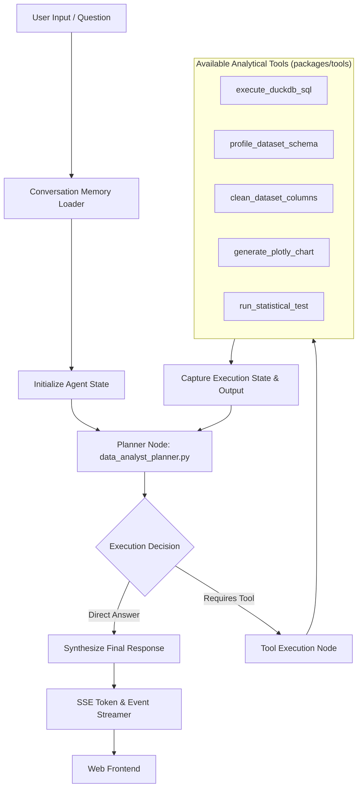

# AI Subsystem Architecture - CHU-Platform

The AI subsystem in `packages/agents` and `packages/tools` provides intelligent, conversational data analysis capabilities.

---

## 1. Agent Architecture & LangGraph Graph

The primary agent, **`DataAnalystAgent`**, is built on **LangGraph**. It coordinates planning, SQL generation, DuckDB execution, statistical analysis, and interactive visualization creation.



---

## 2. Agent Execution State (`packages/agents/data_analyst/state.py`)

The agent state preserves conversation context across turn steps:
```python
class DataAnalystState(TypedDict):
    messages: List[BaseMessage]
    dataset_id: str
    file_path: str
    current_plan: Optional[List[str]]
    execution_steps: List[Dict[str, Any]]
    generated_artifacts: List[Dict[str, Any]]
    error: Optional[str]
```

---

## 3. Tool Suites (`packages/tools/`)

### 3.1 DuckDB Query Tool (`duckdb_tools.py`)
- Executes SQL queries directly against dataset `.csv` or `.parquet` files using DuckDB's `read_csv_auto()` or `read_parquet()`.
- Implements safety limits (truncates max output rows to 500 records by default).

### 3.2 Inspection & Profiling Tools (`inspection.py`)
- Computes column distributions, missing value counts, distinct value counts, and numeric summaries.

### 3.3 Data Cleaning Tools (`cleaning.py`)
- Outlier filtering, null handling, string normalization, and type casting.

### 3.4 Visualization & Chart Tools (`visualization.py` & `packages/analysis/charts.py`)
- Transforms query results into interactive Plotly JSON specs (bar charts, scatter plots, histograms, heatmaps, box plots).
- Automatically writes chart artifacts to disk (`files/exports/`).

---

## 4. Prompt Engineering & System Prompts

Prompts are configured in `packages/agents/data_analyst/prompt.md` and `agent.yaml`.
Key prompt guidelines enforced:
1. **Schema Awareness**: Always check column names and types before generating SQL.
2. **DuckDB Dialect Safety**: Use valid DuckDB SQL syntax (e.g. `EPOCH`, `STRFTIME`, `QUANTILE_CONT`).
3. **Structured Visualizations**: Always return valid Plotly JSON structures when requested to display data visual summaries.
