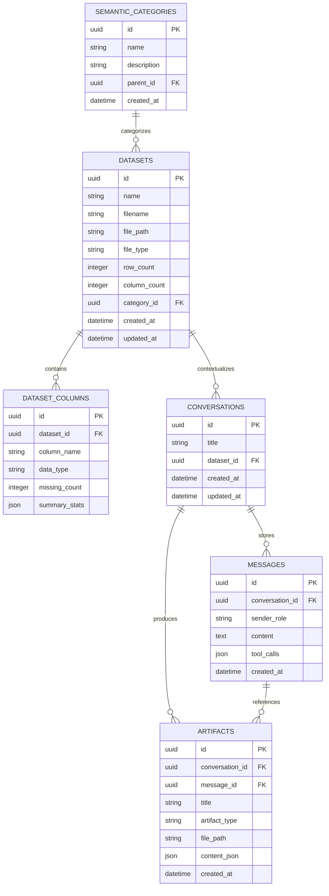

# Database Architecture & Schema Documentation - CHU-Platform

CHU-Platform relies on a dual-database design:
1. **PostgreSQL**: Stores relational domain data, user metadata, datasets catalog, conversations, messages, artifacts, and semantic category mappings.
2. **DuckDB**: Embedded, high-performance OLAP engine executing SQL queries directly on file-backed datasets (`.csv`, `.parquet`).

---

## 1. PostgreSQL ER Diagram



---

## 2. SQLAlchemy ORM Model Definitions (`apps/api/src/api/models/`)

- **`Dataset`**: Maps file paths on host volume (`files/datasets/`), store row/column counts, and dataset metadata.
- **`DatasetColumn`**: Stores inferenced data types (e.g. `INTEGER`, `VARCHAR`, `TIMESTAMP`), nullability, and pre-computed profiling stats (min, max, mean, stddev, quantiles).
- **`Conversation`**: Context window boundary for AI chats. Tied to a specific `dataset_id`.
- **`Message`**: Chat turn history (User vs Assistant) storing raw prompts, AI responses, and JSON tool execution traces.
- **`Artifact`**: Generated output artifacts (Interactive charts, exported CSV clean tables, statistical summary reports).
- **`SemanticCategory`**: Hierarchical category tree allowing classification of datasets.

---

## 3. Database Migrations (Alembic)

Database schema versioning is managed via **Alembic** located in `apps/api/alembic/`.
- Configuration: `apps/api/alembic.ini`
- Migration track: `apps/api/alembic/versions/`

### Running Migrations Manually
```bash
cd apps/api
# Run all pending migrations
uv run alembic upgrade head

# Generate a new migration revision
uv run alembic revision --autogenerate -m "Add new column"
```
