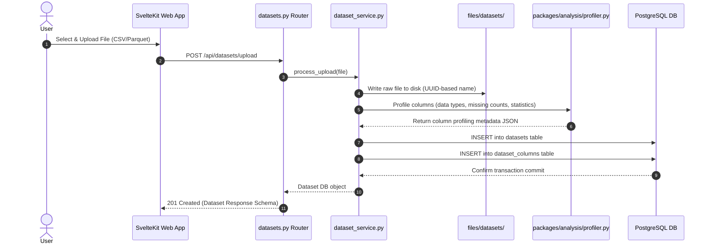
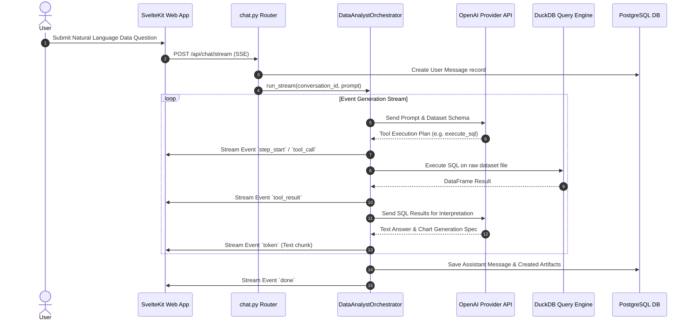

# Data Flow Documentation - CHU-Platform

This document details the lifecycle of data within CHU-Platform across ingestion, query execution, streaming responses, chart rendering, state mutations, and export workflows.

---

## 1. Dataset Ingestion & Profiling Flow

---

## 2. Conversational Agent & SSE Execution Flow

---

## 3. Dynamic Chart Rendering & Artifact Storage

1. **Tool Invocations**: When the agent calls `packages/tools/visualization.py` or `packages/analysis/charts.py`, it constructs a chart spec (Plotly JSON format or Matplotlib figure).
2. **File Persistence**: Plotly specs are saved as JSON artifacts in `files/exports/` and logged in PostgreSQL's `artifacts` table with `artifact_type="chart"`.
3. **Client-Side Hydration**: The SSE stream yields an `artifact` event containing the artifact UUID. The web frontend fetches the artifact payload via `GET /api/artifacts/{id}` and hydrates interactive Plotly components directly in the chat panel.

---

## 4. State Mutations & Memory Persistence

- **Session Context**: Active dataset UUID and category context are bound to each `Conversation` record in PostgreSQL.
- **Agent Memory**: `packages/agents/data_analyst/memory.py` pulls past message history from the PostgreSQL `messages` table and feeds sliding-window context to the LLM during turn iterations.
