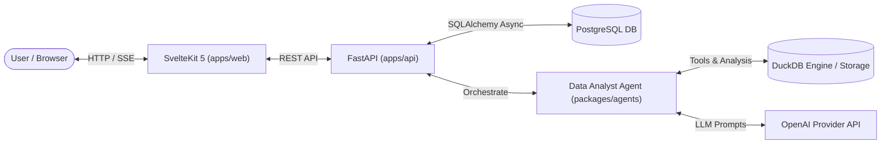

# Project Overview - CHU-Platform

## 1. System Vision & Purpose
**CHU-Platform** (Centre Hospitalier Universitaire Data Platform) is an enterprise-grade, conversational data analysis and visualization system specifically designed for health data analysis, medical stats, and semantic cataloging of complex datasets.

The platform combines a **FastAPI backend**, an **in-memory DuckDB analytical engine**, a **LangGraph-driven Data Analyst Agent**, and a **SvelteKit 5 web interface** to allow non-technical domain experts (clinicians, researchers, administrators) to query datasets using natural language, auto-generate interactive visualizations, perform statistical profiling, and create re-usable data artifacts.

---

## 2. Key System Capabilities

### 📄 Conversational Data Analysis
- **Natural Language Querying**: Users ask data questions (e.g. *"Show distribution of patient age by admission category"*).
- **Server-Sent Events (SSE)**: Real-time token-by-token text streaming and intermediate step notifications (SQL execution, chart generation, data cleaning).
- **Contextual Memory**: Multi-turn conversation persistence tied to specific datasets and semantic category filters.

### 📊 In-Memory & File-Based Analytics Engine
- **DuckDB Integration**: Fast SQL queries directly against raw CSV and Parquet files without requiring pre-ingestion into heavy data warehouses.
- **Data Profiling**: Automatic missing value checks, summary stats, data types, and value distribution extraction.
- **Data Transformation & Cleaning**: Type casting, null imputation, column renaming, and outlier detection.

### 📈 Dynamic Chart & Artifact Generation
- **Plotly & Matplotlib Renderers**: Dynamic creation of interactive Plotly JSON specs and PNG chart artifacts.
- **Artifact Management**: Generated charts, data tables, and filtered datasets are saved as artifacts downloadable directly from the chat interface.

### 🏷️ Semantic Categories & Metadata Cataloging
- **Semantic Classification**: Datasets and columns can be mapped to domain-specific semantic categories (e.g., patient metrics, hospital ops, financial records).
- **Rich Schema Metadata**: Store custom column descriptions, constraints, and data definitions in PostgreSQL.

---

## 3. High-Level System Architecture

---

## 4. Primary User Workflows

### Workflow 1: Dataset Upload & Profiling
1. User navigates to Dataset Management page in `apps/web`.
2. Uploads a `.csv` or `.parquet` file.
3. System saves raw file to `files/datasets/`, triggers automatic profiling via DuckDB tools, and writes dataset metadata to PostgreSQL.

### Workflow 2: Conversational Data Exploration
1. User creates or opens a Conversation thread associated with a dataset.
2. User submits a prompt.
3. FastAPI delegates prompt to `DataAnalystOrchestrator`.
4. Agent generates SQL queries, runs them against DuckDB, builds chart artifacts, and streams step-by-step feedback via SSE.
5. User interacts with returned charts and downloads exported artifacts.

---

## 5. Technology Stack Summary

| Domain | Technology |
| :--- | :--- |
| **Backend Framework** | Python 3.11+, FastAPI, Uvicorn |
| **Database & ORM** | PostgreSQL 16, SQLAlchemy 2.0 (AsyncIO), Alembic |
| **Analytics Engine** | DuckDB, Pandas, NumPy, SciPy |
| **AI Framework** | LangGraph, LangChain Core, OpenAI API |
| **Frontend Framework** | SvelteKit 5, Svelte 5, TailwindCSS, TypeScript |
| **Reverse Proxy & Gateway** | Nginx |
| **Package / Environment Management** | `uv` (Python monorepo workspace), Bun / npm (Node workspaces) |
| **Containerization** | Docker, Docker Compose |
